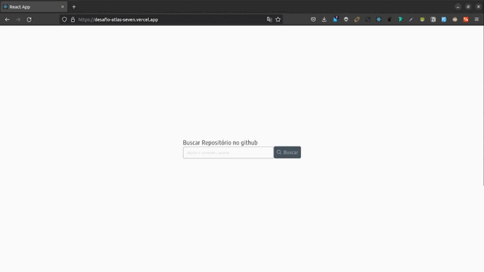
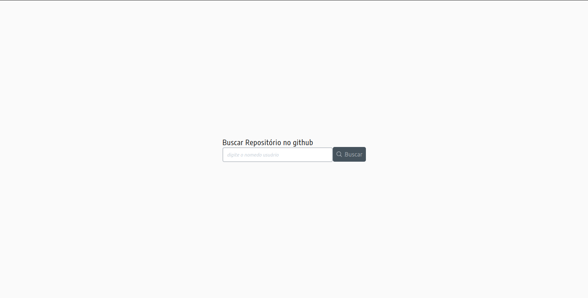
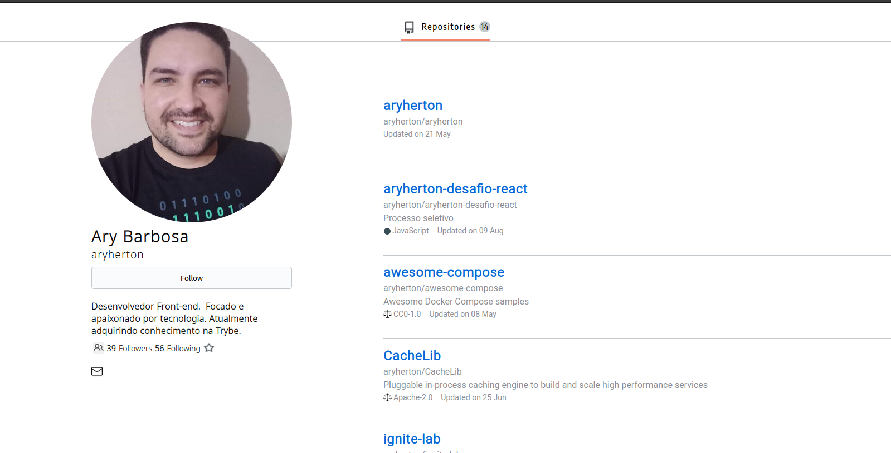

# Desafio React(Teste seletivo - Atlas)

Esse projeto tem como objetivo, desenvolver uma aplicação,
para consumir api(github).

## Funcionalidades

    [*] Pesquisar pelo nome do usuário, deve redirecionar para página de perfil.
      Com informações do usuário e seus repositórios

    [*]Clicar no botão "Buscar", com campo de pesquisa sem valor.
      Deve retornar a seguinte mensagem: "informe um nome de usuário válido do github".

    [*]Pesquisar por um nome de usuário invalido deve retornar:
      "Usuário não encontrado no github. Verifique se você digitou o nome corretamente"


## 🚀 Começando

Seguindo as instruções abaixo, você conseguira rodar localmente o projeto para fins de desenvolvimento e teste.

</br>

### 📋 Pré-requisitos

node 16  <br /><br />
<a href="https://nodejs.org/pt-br/download/">Instalar Node.js</a><br /><br />

### 🔧 Instalação

Baixe o projeto para sua máquina:

```git clone git@github.com:aryherton/aryherton-desafio-react.git```

Acesse a pasta do projeto:

```cd - caminho da pasta -```

Dentro da pasta do projeto digite:

```npm install```

Apos instalar as dependências, rode o seguinte comando:

```npm start```

## 🛠️ Construído com


</br>
-----------------------------------------------------------------------------------------------------------------------------
</br>

## Projeto
### Link: https://desafio-atlas-seven.vercel.app/home


</br></br>

## Pagina de pesquisa:



</br></br>

## Pagina de perfil:



</br></br>

## ✒️ Autor

</br>

Ary Barbosa<br>
aryhertonbarbosa@gmail.com<br /><br />

<a href="https://github.com/aryherton">github</a><br /><br />
<a href="https://www.linkedin.com/in/aryherton/"> linkedin</a><br /><br />


Gratidão
 😊
